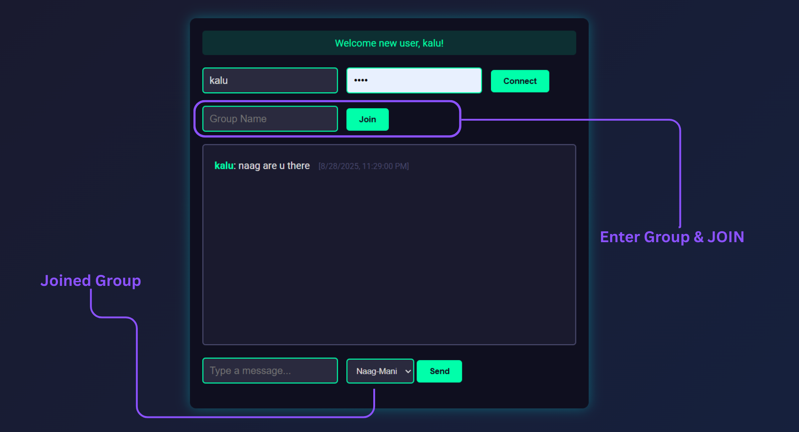

# SocketChat

A lightweight real‑time group chat built with Spring Boot, WebSockets (STOMP over SockJS), and MySQL. I built this to explore simple realtime messaging with a clean, minimal stack and a single static front‑end page.

---

## Screenshots

> From `Screenshots/` in this repo





---

## What it does

- Users can “sign in” with a username/password (simple status response: created/found/wrong).
- Join any group by name; if it doesn’t exist, it’s created.
- Receive past messages for the joined group (history backfill) and live messages in realtime.
- Single static page UI with neon-ish theme.

---

## Tech stack

- Backend: Spring Boot 3.5.x (Java 17)
  - Web, WebSocket (STOMP), Data JPA
- DB: MySQL (Connector/J)
- Build: Maven
- Frontend: Static HTML + SockJS + STOMP.js

Key deps are in `pom.xml`.

---

## Project layout

- `src/main/java/com/suguru/geto/socket/chat/`
  - `SocketChatApplication.java` — Spring Boot entry point
  - `config/WebSocketConfig.java` — STOMP endpoint `/stomp`, broker `/topic` and `/queue`, prefixes `/app` and `/user`
  - `controller/UserController.java` — `POST /api/users` (create/login)
  - `controller/ChatController.java` — STOMP handlers
    - `/app/chat.joinGroup` — join group + backfill history to `/user/queue/group/{name}`
    - `/app/chat.sendMessage` — broadcast to `/topic/group/{name}`
  - `service/ChatService.java` — user/group lifecycle, persist messages
  - `model/` — JPA entities: `User`, `ChatGroup`, `ChatMessage`
  - `repository/` — Spring Data JPA repos
  - `payload/` — `UserRequest`, `ChatMessageDto`
- `src/main/resources/`
  - `application.properties` — app name, datasource, JPA
  - `static/index.html` — single‑page UI
- `Screenshots/` — PNGs used in README

---

## Configuration

`src/main/resources/application.properties` (excerpt):

```properties
spring.application.name=SocketChat
spring.datasource.url=jdbc:mysql://localhost:3306/chat_app?createDatabaseIfNotExist=true&useSSL=false&serverTimezone=UTC
spring.datasource.username=root
spring.datasource.password=${DB_Pass}
spring.datasource.driver-class-name=com.mysql.cj.jdbc.Driver
spring.jpa.hibernate.ddl-auto=update
spring.jpa.show-sql=true
```

- Set `DB_Pass` in your environment (recommended) or replace with a literal password for local testing.
  - PowerShell: `$env:DB_Pass="yourpass"`
  - Bash: `export DB_Pass=yourpass`
- MySQL will auto‑create `chat_app` schema if missing (via JDBC param).

CORS for STOMP endpoint allows `http://localhost:8080` by default; change in `WebSocketConfig` if needed.

---

## Run locally

1) Requirements
- Java 17+
- Maven 3.9+
- MySQL running locally

2) Create DB (optional if using createDatabaseIfNotExist)
```sql
CREATE DATABASE IF NOT EXISTS chat_app;
```

3) Build & run
```bash
mvn clean package
mvn spring-boot:run
# or
java -jar target/SocketChat-0.0.1-SNAPSHOT.jar
```

4) Open UI
- Navigate to `http://localhost:8080/` and use the page.

---

## How the realtime flow works

- Client connects to SockJS endpoint `/stomp` and upgrades to STOMP.
- On joining a group (`/app/chat.joinGroup`):
  - Server ensures the group exists.
  - Past messages are sent only to the requester’s user queue: `/user/queue/group/{group}`.
- On sending a message (`/app/chat.sendMessage`):
  - Server persists the message (with timestamp) and publishes to `/topic/group/{group}` for everyone in that group.

---

## REST and STOMP contract

- REST
  - `POST /api/users` → body `{ username, password }` → response: `"created" | "found" | "wrong"`

- STOMP (client → server)
  - `/app/chat.joinGroup` — payload: string group name
  - `/app/chat.sendMessage` — payload JSON:
    ```json
    { "sender": "alice", "content": "hi", "groupName": "general" }
    ```

- STOMP (server → client)
  - `/user/queue/group/{group}` — historical messages (private)
  - `/topic/group/{group}` — new messages (public topic)

---

## Notes & caveats

- Passwords are stored in plain text (demo simplicity). For anything real:
  - Hash with BCrypt/Argon2, add validation, sessions/JWT, CSRF, etc.
- No DB migrations (Flyway/Liquibase) — schema managed by JPA `ddl-auto=update`.
- Single basic UI page; no build tooling.
- Allowed origins are restricted for STOMP; adjust for your front‑end host if different.

---

## Roadmap (nice‑to‑have)

- Proper auth (hashing, tokens), user sessions
- Message pagination and lazy history load
- Typing indicators, presence, read receipts
- Basic moderation (ban/kick), private DMs
- Docker Compose for app + MySQL
- Migrations with Flyway
- A few integration tests

---

## License

MIT for the sample code unless noted otherwise.
